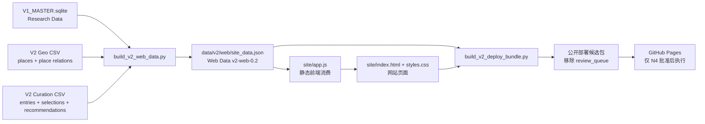

# 拉丁美洲文学地图 V2：Sol 独立审计交接包

- **交接日期**：2026-08-11
- **审计对象**：V2 网站阶段从治理初始化到 `V2-N4` 发布审核前的全部生成材料、数据链路、网站代码和 QA 记录
- **当前状态**：`V2.0.0-rc.2` 整改候选已通过内部复核；当前停在 `V2-N4 = USER_REVIEW`
- **重要边界**：V2 尚未正式发布；没有 V2.0.0 tag、没有正式 Pages 部署、没有正式公开 URL
- **建议审计方式**：独立复核，不修改仓库文件，不替项目作正式发布决定

## 1. 先看结论

V2 已完成以下闭环：

> V1 Research Data + V2 Geo Data + Curation Data
> → 可重复生成的 Web Data
> → 静态网站
> → 本地发布候选包与发布边界检查

当前已完成：

- V2 产品治理、任务状态源和决策记录；
- 地图数据补充与现实/虚构空间边界；
- Research Data 与 Curation Data 分层；
- N2 最小原型、N2 用户批准、完整数据接入；
- 首页、地图、国家/地点/作者/作品/关联节点页、搜索、时间线、研究证据层；
- N3 完整测试站内部 QA 与用户批准；
- V2.0.0-rc.1 历史候选，以及 rc.2 整改后的数据冻结、公开边界 QA、部署候选验证和发布说明。

当前仍需用户或仓库外部条件决定：

- `V2-N4` 是否批准正式公开发布；
- 是否配置并确认正式 HTTPS `V2_SITE_ORIGIN`；
- 是否由仓库所有者启用并执行 GitHub Pages 部署；
- 是否创建正式 commit、`V2.0.0` tag、Release 和公开 URL。

## 2. V2 阶段过程与节点

| 阶段/节点 | 主要生成内容 | 状态 |
|---|---|---|
| V2-N1 | 产品决策书、V2 治理扩展、执行体系 | 已通过 |
| 阶段 0 | `V2_TASKS.md`、Charter 1.5.0、DEC-040 | 已完成 |
| 阶段 1 | 数据适配审计、地图补充、地图 QA | 已完成 |
| 阶段 2 | Curation Schema、Web Data Schema、构建/校验脚本 | 已完成 |
| 阶段 3—4 | N2 样本、最小策展包、静态网站原型、N2 QA | 已完成 |
| V2-N2 | 核心交互原型审核 | 用户已批准，解锁阶段 5—7 |
| 阶段 5 | 全量页面覆盖、批量策展草稿、USER_REVIEW 汇总 | 已完成 |
| 阶段 6 | 完整首页、地图、页面、搜索、时间线、研究层、响应式/可访问性 | 已完成 |
| 阶段 7 | 完整测试站内部 QA、N3 审核包 | 已完成 |
| V2-N3 | 完整测试站审核 | 用户已批准，解锁阶段 8 |
| 阶段 8 | 数据冻结、公开边界、部署候选验证、发布说明 | 已完成 |
| V2-N4 | 正式公开发布审核 | 当前等待用户审核 |

用户节点证据在：

- `V2_TASKS.md`：动态状态与节点状态；
- `拉丁美洲文学地图_项目决策记录.md`：DEC-040 至 DEC-044；
- `docs/V2_N2_PROTOTYPE_REVIEW.md`：N2 审核包；
- `docs/V2_N3_FULL_TEST_SITE_REVIEW.md`：N3 审核包；
- `docs/V2_RELEASE_NOTES.md`：当前发布候选说明。

## 3. 文件阅读顺序

### 3.1 治理与产品决策

按以下顺序阅读：

1. `PROJECT_CHARTER.md`：项目总章程，V2 的版权、来源、数据、AI 和发布边界以上位规则为准；
2. `V2_网站产品决策与开发总说明书.md`：V2 最高专项说明书，状态为 `FROZEN / USER APPROVED`；
3. `V2_执行体系与任务清单.md`：V2 文件层级、节点和任务管理规则；
4. `V2_TASKS.md`：V2 唯一动态状态源；
5. `拉丁美洲文学地图_项目决策记录.md`：V2 决策链 DEC-040—DEC-044；
6. `README.md`、`CHANGELOG.md`：项目入口和版本变更摘要。

### 3.2 V1 研究基线

- `data/master/V1_MASTER.sqlite`：V2 的 Research Data 基线；
- `data/master/README.md`：主库说明；
- `scripts/validate_master.py`：V1 主库结构和引用校验；
- `docs/V1_版本摘要.md`、`docs/V1_正式发布说明.md`、`docs/V1_已知问题.md`：V1 正式基线、已知问题和发布边界。

不要把本地原始阅读材料当作 V2 公开发布材料。`N1阅读材料/`、`N1-OCR-*/`、`inputs/`、PDF、EPUB、Cookie、密钥和环境配置属于审计范围外的私有/受限材料。

### 3.3 阶段 1—2：数据适配和契约

- `docs/V2_DATA_READINESS_AUDIT.md`
- `docs/V2_MAP_DATA_QA.md`
- `docs/V2_CURATION_SCHEMA.md`
- `data/v2/curation/README.md`
- `docs/V2_WEB_DATA_SCHEMA.md`
- `docs/V2_TECHNICAL_FOUNDATION.md`
- `scripts/build_v2_web_data.py`
- `scripts/validate_v2_web_data.py`

### 3.4 阶段 3—4：N2 样本和网站原型

- `docs/V2_N2_SAMPLE_SET.md`
- `docs/V2_N2_MINIMAL_CURATION_QA.md`
- `docs/V2_N2_PROTOTYPE_REVIEW.md`
- `docs/V2_HOME_MAP_PROTOTYPE.md`
- `docs/V2_PAGE_TEMPLATES.md`
- `docs/V2_SEARCH_TIMELINE.md`

### 3.5 阶段 5：全量数据和策展

- `docs/V2_FULL_PAGE_COVERAGE.md`
- `data/v2/qa/V2_PAGE_COVERAGE.csv`
- `scripts/build_v2_coverage_plan.py`
- `docs/V2_FULL_CURATION_DRAFTS_QA.md`
- `data/v2/qa/V2_CURATION_BATCH_BUILD.json`
- `scripts/build_v2_full_curation_drafts.py`
- `docs/V2_CURATION_USER_REVIEW.md`
- `data/v2/curation/CURATION_ENTRIES.csv`
- `data/v2/curation/CURATION_SELECTIONS.csv`
- `data/v2/curation/CURATION_RECOMMENDATIONS.csv`

### 3.6 阶段 6—7：网站实现和完整 QA

网站实现：

- `site/index.html`
- `site/styles.css`
- `site/app.js`
- `site/README.md`

完整化和 QA 文档：

- `docs/V2_HOME_FULL.md`
- `docs/V2_MAP_FULL.md`
- `docs/V2_PAGES_FULL_QA.md`
- `docs/V2_SEARCH_FULL_QA.md`
- `docs/V2_TIMELINE_FULL_QA.md`
- `docs/V2_RESEARCH_EVIDENCE_QA.md`
- `docs/V2_RESPONSIVE_A11Y_QA.md`
- `docs/V2_N3_FULL_TEST_SITE_REVIEW.md`

### 3.7 阶段 8：冻结、公开边界和部署候选

- `data/v2/web/site_data.json`：源 Web Data，含独立 `review_queue`；
- `data/v2/web/manifest.json`：Web Data 统计和生成信息；
- `data/v2/release/V2.0.0_RELEASE_MANIFEST.json`：候选输入文件、SHA-256、排除规则和外部前置条件；
- `docs/V2_RELEASE_DATA_FREEZE.md`
- `docs/V2_PUBLIC_BOUNDARY_QA.md`
- `docs/V2_DEPLOYMENT_PREP.md`
- `docs/V2_RELEASE_NOTES.md`
- `scripts/build_v2_deploy_bundle.py`
- `scripts/build_v2_release_manifest.py`
- `.github/workflows/v2-pages.yml`

## 4. 数据生成链路



关键原则：

- 前端不硬编码研究事实；
- Research Data 负责实体、事实、关系、内容卡、来源、hold 和 gap；
- Geo Data 只补充地图技术层，不替换 V1 研究关系；
- Curation Data 负责展示选择和策展文案，不写入研究关系；
- Web Data 是网站唯一数据消费契约；
- 公共部署副本只保留 `auto_approved` 策展层，不公开 `review_queue`；
- 虚构空间不能生成现实坐标；
- hold、user_review、research gap 和未确认分类不得被前端静默确定化。

## 5. 当前数据快照

### 5.1 V1 与 Web Data 统计

| 项目 | 数量 | 主要来源 |
|---|---:|---|
| 实体 | 144 | V1 主库 / Web Data |
| 正式关系 | 76 | V1 主库 / Web Data |
| relation hold | 40 | V1 主库 / Web Data |
| 事实 | 238 | V1 主库 / Web Data |
| 内容卡 | 40 | V1 主库 / Web Data |
| 来源 | 74 | V1 主库 / Web Data |
| research gap | 13 | V1 主库 / Web Data |
| 地图地点行 | 24 | `PLACES_GEO.csv` |
| 地点关系 | 25 | `PLACE_RELATIONS.csv` |
| 策展条目 | 51 | `CURATION_ENTRIES.csv` |
| 策展选择 | 19 | `CURATION_SELECTIONS.csv` |
| 策展推荐 | 2 | `CURATION_RECOMMENDATIONS.csv` |

### 5.2 地图与页面覆盖

- 22 个 V1 地点实体加 2 个技术父级节点，共 24 行地图数据；
- 20 个非隐藏公共地图节点，4 个隐藏节点；
- 145 行页面覆盖清单，覆盖全部 144 个 V1 实体并加 1 个技术节点；
- 10 个完整作者页；
- 17 个完整作品页；
- 3 个 research gap 作品页；
- 4 个 related-only 作者；
- 8 个 related-only 作品；
- 7 个国家层页面；
- 14 个现实地点页面；
- 2 个文学虚构空间页面；
- 11 个作品集/策展模块；
- 5 个时间线背景节点；
- 64 个关联节点。

### 5.3 策展和待审边界

- `CURATION_ENTRIES.csv`：51 条，其中 47 条 `auto_approved`、4 条 `hold`；
- `CURATION_RECOMMENDATIONS.csv`：2 条，分别为 1 条 `user_review` 阅读推荐和 1 条 `hold` 跨作品比较；
- 源 Web Data 的 `review_queue` 保留审核记录，但不作为公共策展层消费；
- 3 部作品继续是 research gap；
- 1 个地点分类仍待确认，继续保持隐藏/不确定边界；
- 40 条 V1 relation hold 继续保留，不因网站展示而变成确定关系。

## 6. 网站功能与路由契约

前端为纯静态 hash-routed 单页应用，没有 `package.json` 或运行时依赖。

| 路由 | 用途 |
|---|---|
| `#/` | 首页、精选入口、完整范围再发现 |
| `#/country/{place_id}` | 国家层地图与地点下钻 |
| `#/place/{place_id}` | 现实地点或文学虚构空间页 |
| `#/author/{entity_id}` | 作家页 |
| `#/work/{entity_id}` | 作品页 |
| `#/node/{entity_id}` | 研究关联节点回退页 |
| `#/search` / `#/search?q=...` | 搜索和类型筛选 |
| `#/timeline` | 文学时期、作者、作品和背景节点时间线 |
| `#/about` | 项目说明和研究边界 |

核心行为：

- 地图支持国家 → 地点下钻；
- 地图区分作者地理、作品故事空间和文学虚构空间；
- 虚构空间无现实坐标；
- 页面有普通阅读层和研究证据层；
- 研究缺口、related-only、hold、user_review 有状态门；
- 搜索索引覆盖 146 个目标：144 个研究实体加 2 个技术父级节点；
- 时间线包含 10 个作者节点、28 个作品节点和 5 个历史背景节点；
- 支持移动导航、键盘焦点、`aria-live`、`aria-pressed`、减动画、加载/空结果/404 状态；
- 当前 `DATA_URL` 会根据 `/site/` 路径在源码站点和根目录部署包之间切换。

## 7. 已完成的验证证据

已记录或已执行的验证包括：

- V1 主库完整性和引用验证通过；
- V2 Web Data 构建成功；
- `validate_v2_web_data.py` 返回 `PASS`；
- Web Data schema 为 `v2-web-0.2`；
- 地图 CSV 字段宽度、实体覆盖、关系回溯和虚构空间无坐标规则通过；
- 策展 CSV 字段、状态枚举、目标 ID 和研究/策展边界通过；
- 前端未发现硬编码研究事实；
- 网站未加载外部图片、字体、脚本或未许可媒体资产；
- `node --check site/app.js` 通过；
- `git diff --check` 通过；
- 工作流 YAML 已解析；
- 本地部署候选包的 `/`、`/index.html`、`/404.html`、`/app.js`、`/styles.css`、`/data/v2/web/site_data.json` 均返回 HTTP 200；
- 公开部署数据副本不含 `review_queue`；
- 发布候选清单记录 15 个部署输入文件的 SHA-256，并由工作流在部署前复核。

审计时应区分：

1. **已实现**：代码、数据或脚本中确实存在；
2. **已验证**：有可重复命令、QA 记录或可观察结果支持；
3. **仅文档声称**：文档写了，但未找到实现或证据；
4. **待用户决定**：产品、策展、发布等需要 USER 判断；
5. **外部依赖**：需要仓库设置、域名、Pages 或其他外部条件。

## 8. 建议的复核命令

为避免审计过程改写当前候选包，凡会写回 `data/v2/web/` 或 `data/v2/release/` 的命令，建议在临时副本执行。

```bash
python3 scripts/validate_master.py data/master/V1_MASTER.sqlite
python3 scripts/build_v2_web_data.py --generated-at 2026-08-11T00:00:00+08:00
python3 scripts/validate_v2_web_data.py
python3 scripts/build_v2_release_manifest.py --freeze-at 2026-08-11T00:00:00+08:00 --release-state pending_v2_n4
python3 scripts/build_v2_release_manifest.py --verify
node --check site/app.js
git diff --check
```

还应检查：

- 重建前后 Web Data 统计是否一致；
- `data/v2/release/V2.0.0_RELEASE_MANIFEST.json` 的范围、哈希和候选状态是否自洽；
- `scripts/build_v2_deploy_bundle.py` 是否确实移除 `review_queue`；
- `.github/workflows/v2-pages.yml` 是否保持手动触发、HTTPS origin 门禁和正式 N4 前不自动发布；
- 当前工作树是否仍为未提交的 V2 工作状态，而不是误称为已提交/已推送。

## 9. 当前剩余事项与审计重点

这些事项不是隐藏问题，应在审计结论中单独列出：

- V2-N4 尚未获得正式发布批准；
- 正式 HTTPS origin 尚未确认；
- GitHub Pages 实际部署尚未执行；
- 正式 tag、Release、公开 URL 尚未产生；
- 3 部 research gap 作品仍需后续补证；
- 1 个地点分类仍待确认；
- 1 条阅读推荐和 1 条跨作品比较仍未进入公共策展层；
- hash 路由适合静态首版，但不等于服务端渲染或 SEO 完整方案；
- 当前分支和工作树仍需在 N4 之后按项目 Git 门禁另行收口。

Sol 的审计不应擅自解决以上用户决定或外部依赖，也不应通过删除 hold/gap、修改冻结数据或直接发布来“修复”它们。

## 10. Sol 应交付的审计结果

建议最终报告至少包含：

1. 总体结论：通过、带条件通过或不通过；
2. V2 过程复盘：阶段、产物、节点和授权链；
3. 文件材料清单：缺失、重复、过时或互相矛盾的文件；
4. 数据血缘和数量对账：V1 → Geo/Curation → Web Data → 前端；
5. 前端路由与功能核验；
6. QA 证据复核：命令、输出、可重复性和覆盖范围；
7. 公开边界与发布准备核验；
8. 文档声称与实际实现之间的差异；
9. P0/P1/P2/P3 问题清单；
10. 对 `V2-N4` 的建议：批准、附条件批准或暂缓，以及明确理由。

每个问题应包含：严重级别、精确文件路径、行号/字段/命令、证据、影响和建议动作。
